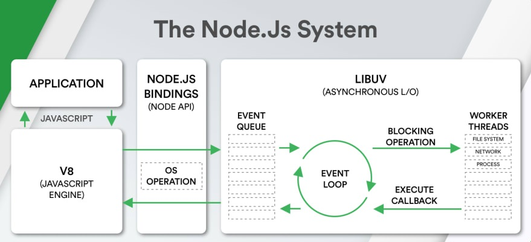

# 🚀 Nodejs Roadmap

Node.js® is a JavaScript runtime built on Chrome's V8 JavaScript engine.


Node.js is a runtime environment for executing JavaScript code server-side.

In short, Node.js uses a single thread to handle multiple requests asynchronously, making it scalable and efficient for handling I/O-heavy applications.

# V8 JavaScript engine
The V8 library provides Node.js with a JavaScript engine :

a program that converts Javascript code into lower level or machine code that microprocessors can understand, which Node.js controls via the V8 C++ API. V8 is maintained by Google, for use in Chrome.

# Libuv
libuv is a C library that is used to abstract non-blocking I/O operations to a consistent interface across all supported platforms. It provides mechanisms to handle file system, DNS, network, child processes, pipes, signal handling, polling and streamin

# Key features of Node.js
**Asynchronous event driven IO helps concurrent request handling**

**Fast in Code execution**

**Single Threaded but Highly Scalable**

**Node.js library uses JavaScript**

**There is an Active and vibrant community for the Node.js framework**

**No Buffering**

# NPM
**npm** is the standard package manager for Node.js

**local packages** are installed in the directory where you run npm install <package-name>, and they are put in the node_modules folder

**global packages** are all put in a single place in your system, regardless of where you run npm install -g <package-name>

The **@** symbol is used to denote a scoped package, which is a way to group related npm packages under a namespace
npm install @nestjs/core

**package.json**
file holds various metadata relevant to the project,This file is used to give information to npm that allows it to identify the project as well as handle the project's dependencies

Node.js always runs require synchronously. If you require an external module from within functions your module will be synchronously loaded when those functions run

# Beneficts of using Node.js
**Aynchronous and Event Driven** All APIs of Node.js library are aynchronous that is non-blocking

**Single Threaded but highly Scalable**: Node.js uses a single threaded model with event looping

**Very Fast**  Being built on Google Chrome's V8 JavaScript Engine, Node.js library is very fast in code execution

**No Buffering** Node.js applications never buffer any data. These applications simply output the data in chunks

# Aynchronous API
All APIs of Node.js library are aynchronous that is non-blocking

# Error prefer Error-First Callback
```javascript
fs.readFile(filePath, function(err, data) {
  if (err) {
    //handle the error
  }
  // use the data object
});
```

**process.cwd()** is a method of global object process, returns a string value which is the current working directory of the Node.js process

**__dirname** is the directory name of the current script as a string value

# Some built-in Globals in Nodejs

**true globals**

**global** Setting a property to this namespace makes it globally visible within the running process

**process** which provides interaction with the current Node.js process

**console** which wraps various STDIO functionality in a browser-like way

**setTimeout()**, **clearTimeout()**, **setInterval()**, **clearInterval()** The built-in timer functions are globals

**pseudo-globals**
**module** ,**module.exports**, **exports**,**__filename**, **__dirname**, **require**


# Threads
Node.js is designed to be single-threaded, operating primarily on an event-driven architecture using the event loop. However, it provides mechanisms to leverage additional threads when needed

**Worker Threads**

Workers communicate with the main thread using message passing (via postMessage and onmessage).

```javascript
const { Worker } = require('worker_threads');

if (isMainThread) {
  const worker = new Worker('./worker.js'); // Worker script
  worker.postMessage('Hello, Worker!');
  worker.on('message', (message) => {
    console.log('Message from worker:', message);
  });
} else {
  parentPort.on('message', (message) => {
    console.log('Message from main thread:', message);
    parentPort.postMessage('Hello, Main Thread!');
  });
}

```

**Child Processes**

The child_process module enables spawning child processes to execute external programs or scripts

**spawn()**: Executes a command.

**exec()**: Executes a command with a buffer for the output.

**fork()**: Spawns a new Node.js process with IPC enabled for communication.

```javascript
const { fork } = require('child_process');

const child = fork('./child.js'); // Fork a new process
child.send('Hello, Child Process!');
child.on('message', (message) => {
  console.log('Message from child:', message);
});

```


